# Why CI/CD important ?

Lấy code --> triển khai dự án --> không vấn để cho đến khi nhìu resource

* Development --> dành cho dev (tốn thời gian)
* Staging --> dành cho test
* Production -->

==> triển khai thủ công (╥_╥) ==> check log, monitor, bảo trì, nâng cấp hệ thống.

piple: commit -> build -> test -> deploy

* Continouus intergration

Clone code, tích các tool(test performance, test security) để đảm bảo chất lượng source code

Continuous Integration (CI) là quá trình tự động hóa việc tích hợp và kiểm tra mã nguồn từ các thành viên của nhóm phát triển vào một bản chung, đảm bảo rằng mã nguồn luôn ổn định và tương thích với nhau.

* Contrinous deployment

* Continuous delivery

Continuous Deployment (CD) là quá trình tự động hóa việc phát triển, kiểm thử và triển khai ứng dụng để đưa các tính năng mới và cải tiến lên môi trường sản xuất một cách nhanh chóng và tin cậy.

❓ Tại sao có 2 chiến lược triển khai này

💬 2 chiến lược điểm mạnh, điểm yếu. Tuy nhiên deployment tự động, delivery dễ kiểm soát.

## Triển khai tự động

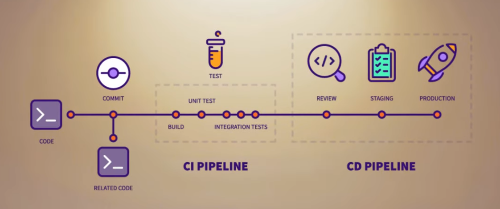

1. Cài đặt công cụ tự động

    --> Gitlab runner

2. Viết file cấu hình công việc

    --> Viết trong source

## 🏗️ Set up gitlab CICD pipeline private registy

📢 Statement of the problem

Will there be a wait period each time a new version is released? hay chúng ta lại ngập trong câu nói quen thuộc `“Code ở dưới local chạy phà phà mà”` vậy nên CICD Pipeline là một phần công việc không thể thiếu trong mỗi dự án.

Bạn có thể hiểu đơn giản là công việc này sẽ khiến cho những phiên bản mới được cập nhật mà `phiên bản cũ vẫn chạy khi hoàn tất phiên bản mới lên` cũng không hề `có khoảng thời gian website bị downtime` vì vậy sẽ hạn chế tối đa việc ảnh hưởng đến người dùng, không những giúp chúng ta `giảm thiểu được thời gian triển khai code lên server` (không còn phải triển khai thủ công bằng tay mà có triển khai thì chục nghìn vài chục nghìn service thì triển khai chay sao nổi), các job test, mà còn làm tăng hiệu quả công việc và vô số lợi ích bạn có thể tìm hiểu thêm.

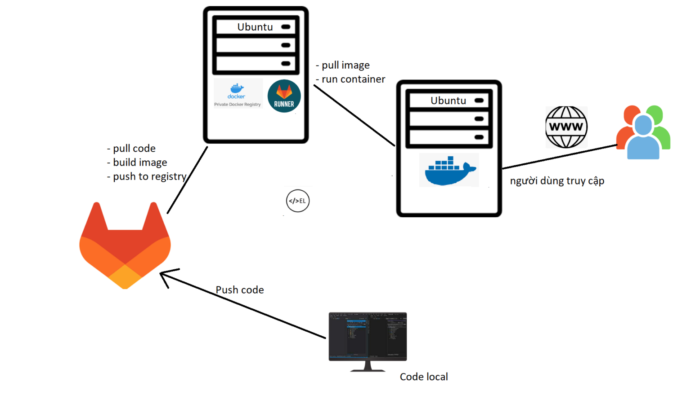

1. 📡 Install Gitlab-Runner connected Gitlab and Registy

### What is gitlab runner ?

Bạn có thể hiểu đơn giản gitlab-runner tương ứng chính là người lấy code từ trên server gitlab về và thực thi các câu lệnh của bạn.

Registry bạn có thể hiểu đơn giản giống như docker hub là một nơi lưu trữ những image và đơn giản hơn nữa nó giống như gitlab vậy khác là gitlab lưu trữ các source code registry lưu trữ các image docker.

===> cài đặt gitlab runner lên trên server deploy code `(ubuntu-dev-s1)`

```bash
apt-get update
```

```bash
curl -L "https://packages.gitlab.com/install/repositories/runner/gitlab-runner/script.deb.sh" | bash
```

```bash
apt-get install gitlab-runner
```

```bash
apt-cache madison gitlab-runner
```

```bash
gitlab-runner -version
```

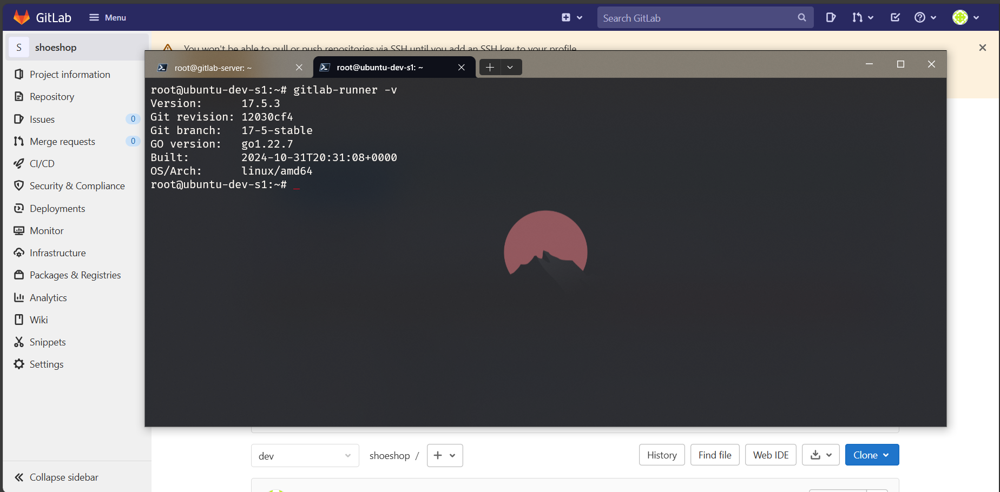

### Kết nối giblab runner với dự án

Khởi tạo gitlab-runner mới theo thứ tự

```bash
gitlab-runner register
```

Nhập gitlab url and token

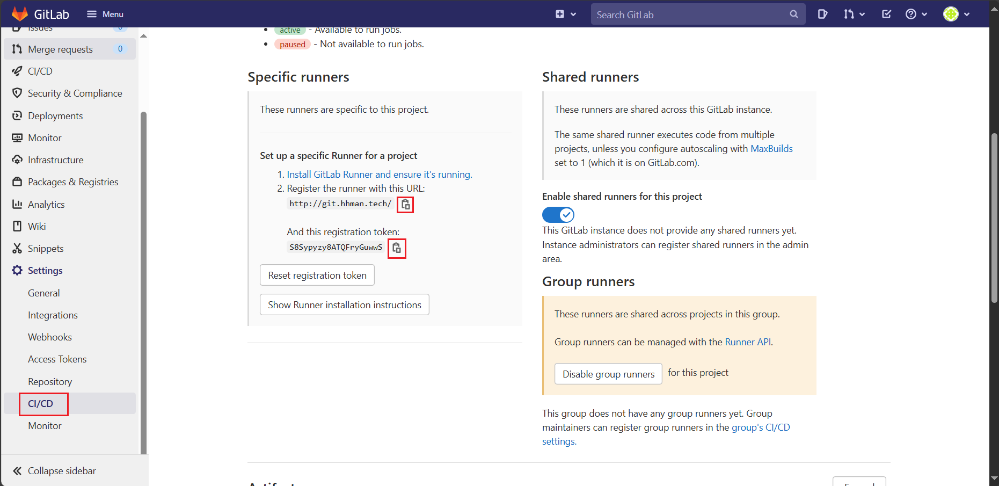

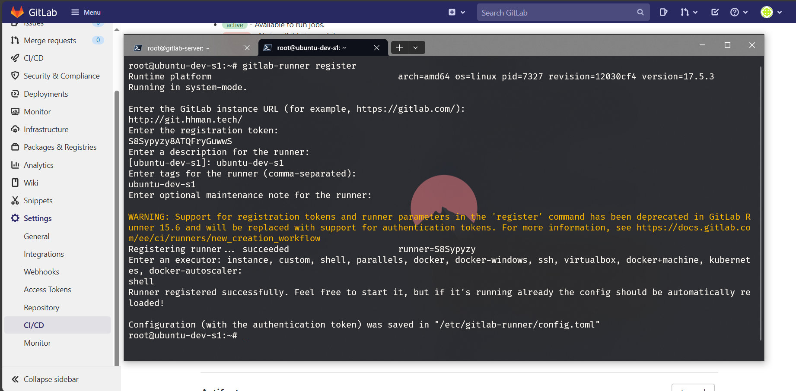

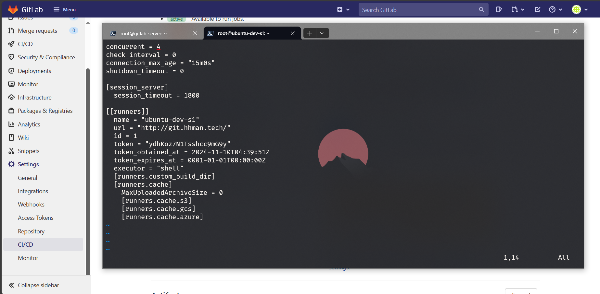

Chỉnh lại `concurent` = 4 mục đích để nói con gitlab-runner này chạy bao nhiêu dự án.

```bash
nohup gitlab-runner run --working-directory /home/gitlab-runner/ --config /etc/gitlab-runner/config.toml --service gitlab-runner --user gitlab-runner 2>&1 &
```

Ghi ra file nohub để coi log. Chú ý các tùy chọn sau:

* `--working-directory`: tùy chọn thư mục làm việc
* `--config`: lựa chọn file cấu hình
* `--service`: chọn service nào
* `--user`: user nào

```bash
ps -ef | grep gitlab-runner
```

Check xem tiến trình chạy thử chưa

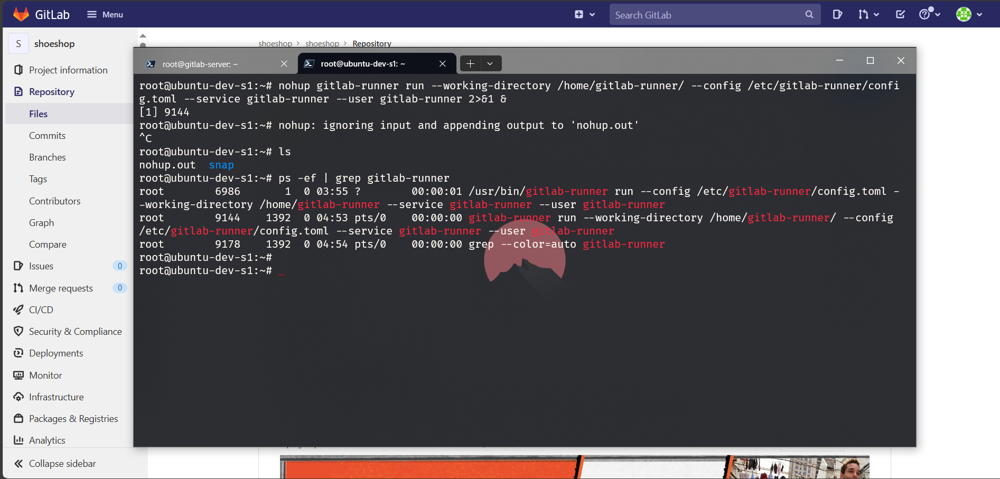

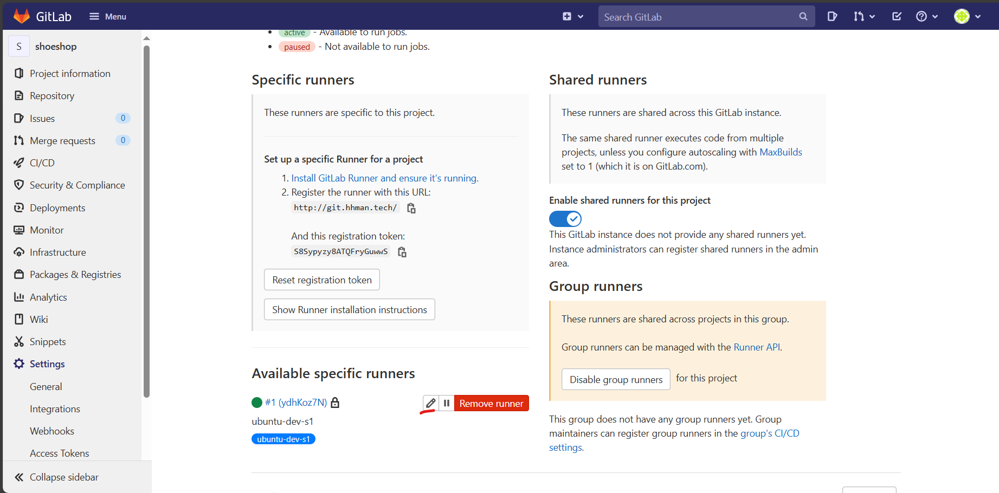

Một số lưu ý cần phải biết:

* `Active`: nếu disable thì runner này không được online.
* `Protective`: nếu enable thì các branch protected mới chạy.
* `Run untagged jobs`: không cần chỉ định chính xác con runner cần chạy.
* `Lock to current projects`: Khi dự án chạy này chạy, các dự án không thể sử dụng con runner này được nữa.

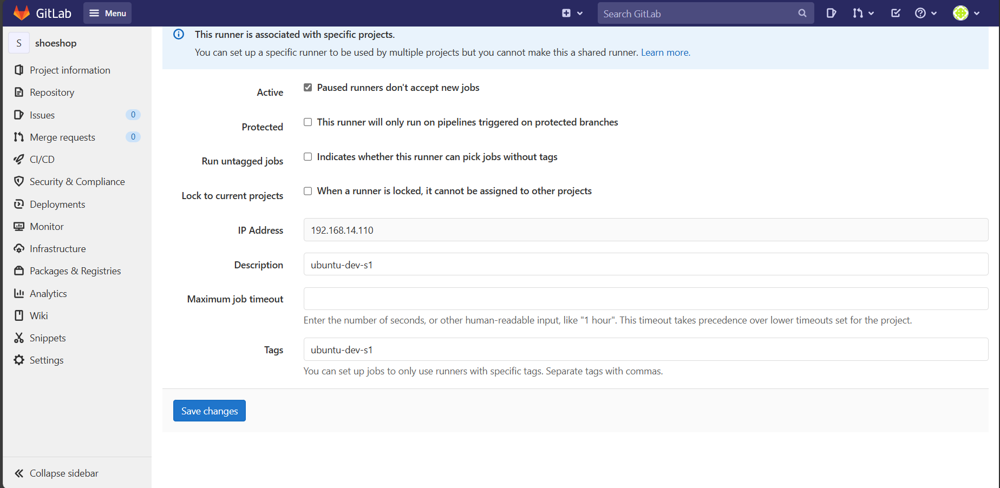

### Viết kịch bản chạy gitlab runner


Note:

* stages: dùng để khai báo cái stage chạy (job)
* build: khai báo job tương ứng trên stages

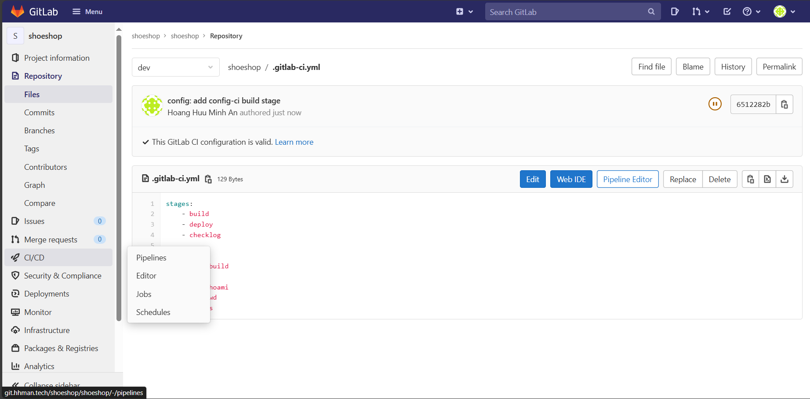

Triển khai CI/CD

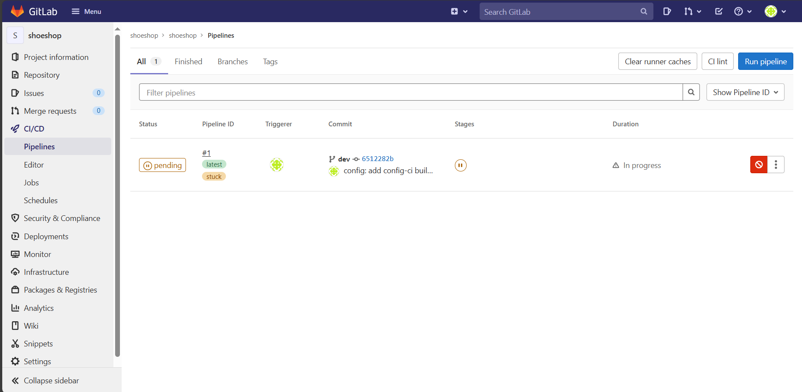

Một pipeline đang bị pending bấm vào để xem chi tiết

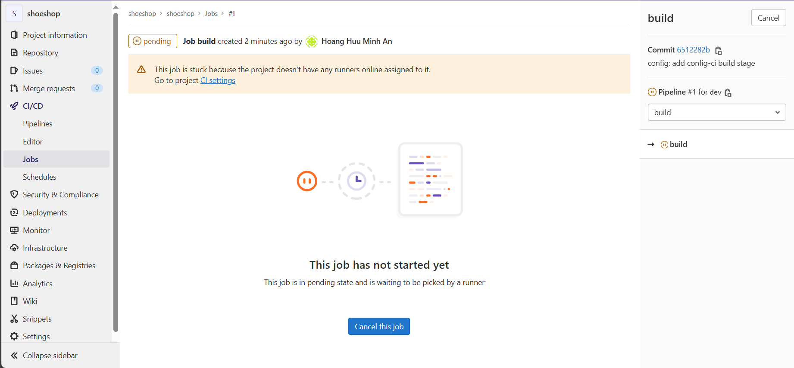

==> Lý do: chưa khai báo một runner cho pipeline

Cancel pipeline này để khai báo trong file `.yml`

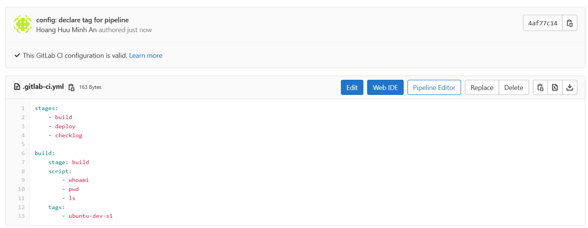

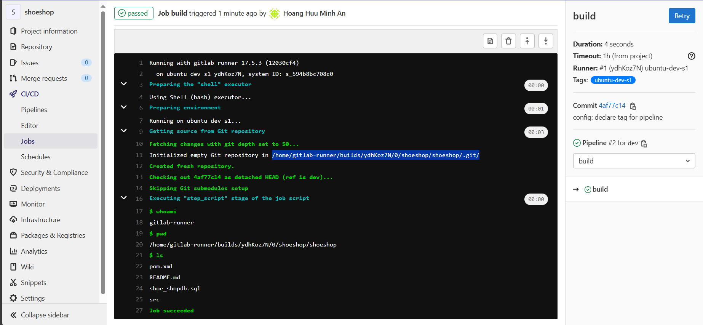

Gilab runner sẽ tự đông kéo code về chạy các lệnh theo kịch bản. Chú ý gilab-runner sẽ đứng lại tại thư mục kéo code về.

Chạy mỗi job thì sẽ xóa code cũ đi lấy code mới từ git về.

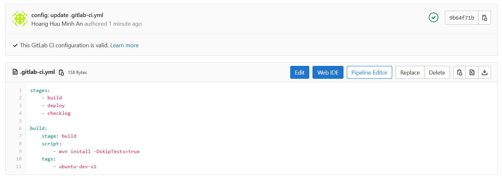

Khai báo để cho gitlab-runner có thể chạy được các lệnh `sudo`. Chỉ cho gitlab-runner chạy một số lệnh

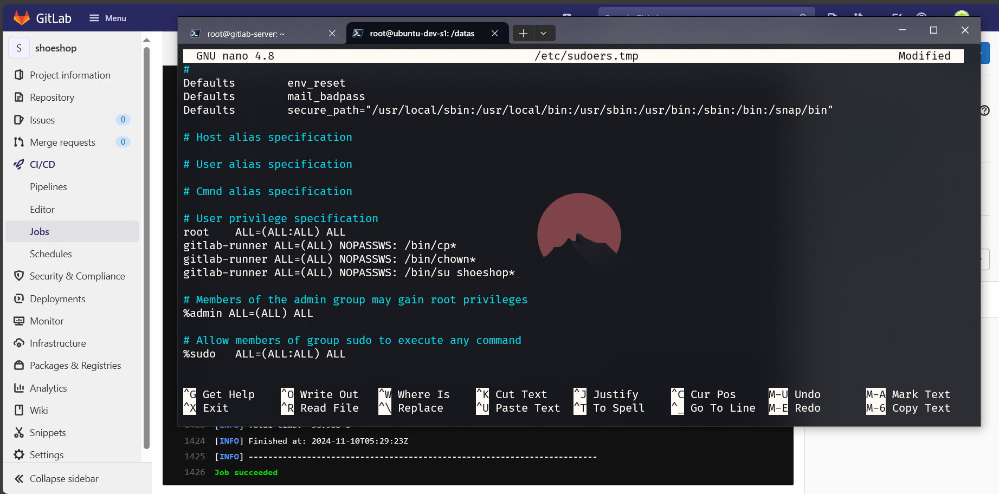

```nano
gitlab-runner ALL=(ALL) NOPASSWS: /bin/cp*
gitlab-runner ALL=(ALL) NOPASSWS: /bin/chown*
gitlab-runner ALL=(ALL) NOPASSWS: /bin/su shoeshop*
```

Tới stage deploy, cần `variables` `GIT_STRATEGY` để cấu hình không xóa mất code.

```yml
stages:
    - build
    - deploy
    - checklog

build:
    stage: build
    variables:
        GIT_STRATEGY: clone
    script:
        - mvn install -DskipTests=true
    tags:
        - ubuntu-dev-s1

deploy:
    stage: deploy
    variables:
        GIT_STRATEGY: none
    script:
        - sudo cp target/shoe-ShoppingCart-0.0.1-SNAPSHOT.jar /datas/shoeshop
        - sudo chown shoeshop. /datas/shoeshop
        - sudo su shoeshop -c "cd /datas/shoeshop; nohup java -jar target/shoe-ShoppingCart-0.0.1-SNAPSHOT.jar 2>&1 &"
    tags:
        - ubuntu-dev-s1
```

Chạy lại script mà ta đã cấp cho runner hồi nãy. Bời vì cấp quyền sai nên chúng ta không thể deploy. Cần xóa process để deploy lại.

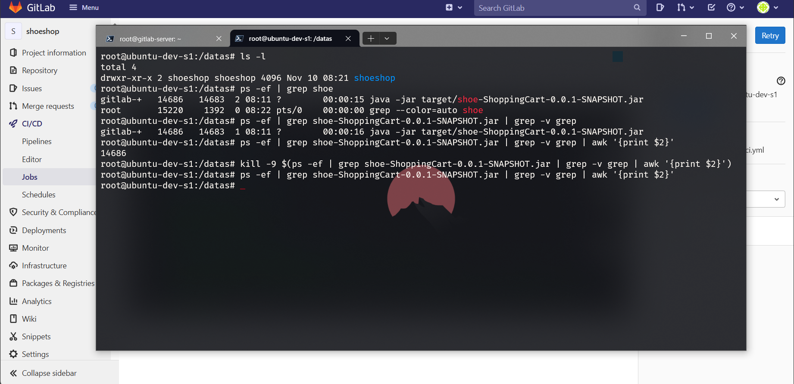

```bash
ps -ef | grep shoe-ShoppingCart-0.0.1-SNAPSHOT.jar | grep -v grep
```

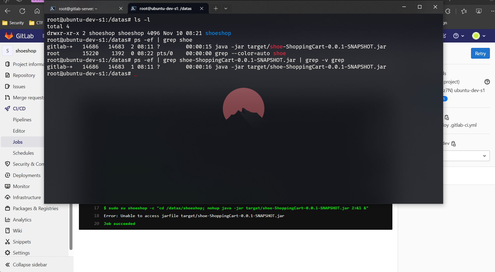

```bash
ps -ef | grep shoe-ShoppingCart-0.0.1-SNAPSHOT.jar | grep -v grep | awk '{print $2}'

kill -9 $(ps -ef | grep shoe-ShoppingCart-0.0.1-SNAPSHOT.jar | grep -v grep | awk '{print $2}')
```

```yml
variables:
    projectName: shoe-ShoppingCart
    version: 0.0.1-SNAPSHOT
    projectUser: shoeshop
    projectPath: /datas/$projectUser/
stages:
    - build
    - deploy
    - checklog

build:
    stage: build
    variables:
        GIT_STRATEGY: clone
    script:
        - mvn install -DskipTests=true
    tags:
        - ubuntu-dev-s1
    only:
        - tags

deploy:
    stage: deploy
    variables:
        GIT_STRATEGY: none
    when: manual
    script:
        - >
            if [ "$GITLAB_USER_LOGIN" == "hhma" ]; then
                sudo cp target/$projectName-$version.jar $projectPath
                sudo chown -R $projectUser. $projectPath
                sudo kill -9 $(ps -ef | grep shoe-ShoppingCart-0.0.1-SNAPSHOT.jar | grep -v grep | awk '{print $2}')
                sudo su $projectUser -c "cd $projectPath; nohup java -jar $projectName-$version.jar > nohup.out 2>&1 &"
            else
                echo "$GITLAB_USER_LOGIN"
                echo "Permission denied"
                exit 1
            fi
    tags:
        - ubuntu-dev-s1
    only:
        - tags

showLog:
    stage: checklog
    variables:
        GIT_STRATEGY: none
    when: manual
    script:
        - sudo su $projectUser -c "cd $projectPath; tail -n 10000 nohup.out"
    tags:
        - ubuntu-dev-s1
    only:
        - tags
```

Dùng để approval để triển khai lên các môi trường cao hơn để check user nào mới có thể deploy.
