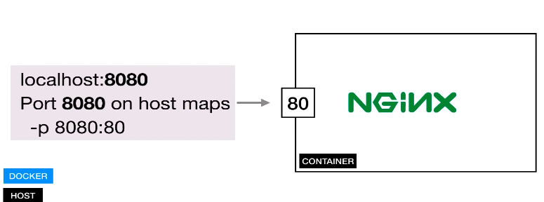
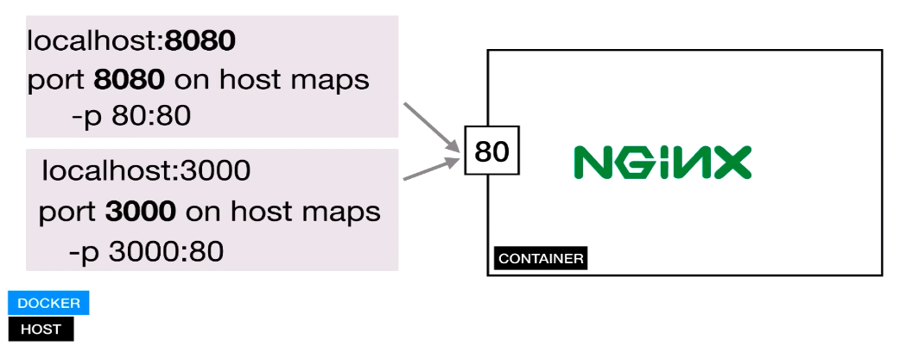
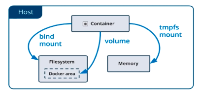
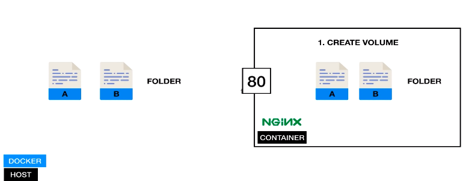
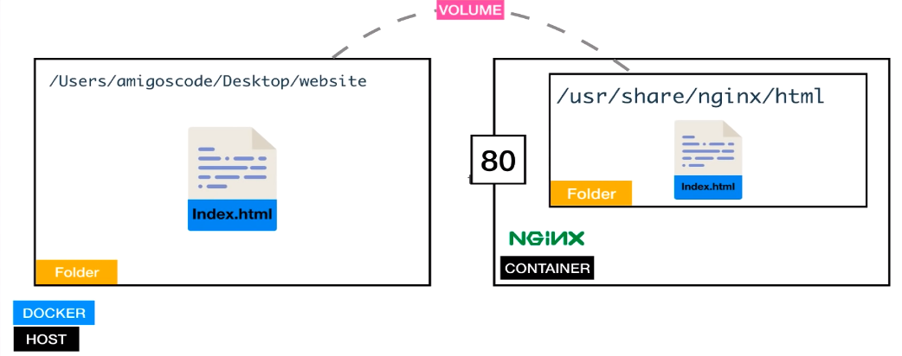
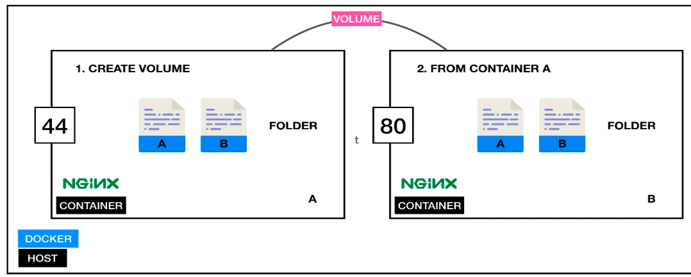
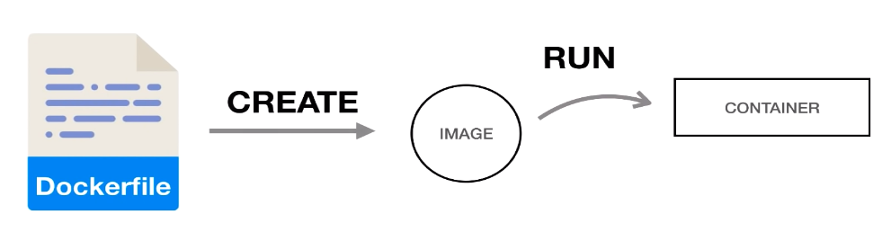

# Docker

Docker provides the ability to package and run application in a loosely **isolated enviroment** called **container**. The isolation and security lets you run many containers simultaneously on a given host. Containers are lighweight and contain everything needed to run the application, so you don't need to rely on what's installed on the host.

## Why use docker ?

* Fast, consistent delivery of your application
* Responsive deployment and scaling
* Running more workloads onthe same hardware

## Verify Docker Installation

You can verify if the container is up and running by using `docker ps` command:

```bash
docker ps
```

## Docker Image vs Container

* Docker Image
  * Image is template for createing an environment of your
  * Snapshot - go back previous Image If have error
  * Hash everything need to run your Apps
  * OS, Software, App code
* Docker Container - isolated processes for each of your app's components. Running instance of an image.


## Pulling Docker Images

Most of your images will be created on top of a base image from Docker hub registry. Docker hub contains many pre-built image that you can pull without defining and configure.

Use web service nginx found on Docker hub and use `docker pull nginx` command.

```bash
docker pull nginx
```

To see which images are present locally

```bash
docker images
```

## Runing docker container

Running a new container

```bash
docker run -d nginx:latest
```

Notes:
    - `-d`: Run container in background and print container ID

View a list of containers, including those that are stopped.

```bash
docker ps -a
```

Stop container

```bash
docker stop 6148fc4f8c38
```

## Exposing ports

So far, we need run docker out computer. Need map locally port to port container.



```bash
docker run -d -p 8080:80 nginx:latest
```

Notes:
    - `-p`: Publish a container's ports to the host.

Exposing Multiple Ports



```bash
docker run -d -p 8080:80 -p 3000:80 nginx:latest
```

## Managing containers

Remove container by Id

```bash
docker rm <docker ID>
```

Remove all container

```bash
docker rm -f $(docker ps -ap)
```

Notes:
    - `-f`: force if container is running

Reality, we should give name for container.

```bash
docker run --name hhman_nginx -d -p 8080:80 -p 3000:80 nginx:latest
```

Notes:
    - `--name`: Asign a name to the container

Formating ps, because interface is beautiful look.

```bash
docker ps --format="ID\t{{.ID}}\nName\t{{.Names}}\nIMAGE\t{{.Image}}\nPORTS\t{{.Ports}}\nCOMMAND\t{{.Command}}\nCREATED\t{{.CreatedAt}}\nSTATUS\t{{.Status}}\n"
```

## Docker Volumes

* Allows sharing of data, Files, & Folders.
* Between `host` and `container`.
* Between `contaiers`.


<!-- Host and Container
 -->

Create volumes between host and container


* Create `hhman_nginx/index.html` and let's go to folder created.

```html
<h1>Hello Docker and Volumes</h1>
```

Mount the folder to our container.

```bash
docker run --name hhman_nginx -v $(pwd):/usr/share/nginx/html:ro -d -p 8080:80 nginx
```

Execute a command in a running container. We have role read-only file, we can't write a new file.

```bash
docker exec -it hhman_nginx bash
```

If want to write a new file in container, we should create below.

```bash
docker run --name hhman_nginx -v $(pwd):/usr/share/nginx/html -d -p 8080:80 nginx
```

Create volumes between container


```bash
docker run --name hhman_nginx2 --volumes-from hhman_nginx -d -p 8181:80 nginx
```

## Customise Websize

Get free bootstrap template on the internet [here](https://startbootstrap.com/themes/landing-pages). Remove all the content in the dowloaded landing-page folder into `hhman_nginx`.

```bash
docker run --name hhman_nginx -v $(pwd)\dist:/usr/share/nginx/html -d -p 8080:80 nginx
```

## Dockerfile

Build oiwn images

