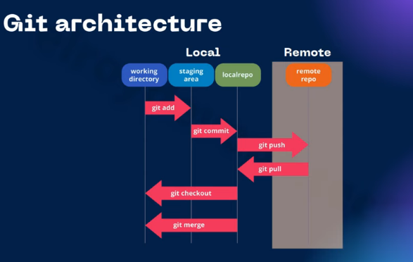

# Git for DevOps

Why should use git ? - quản lý source --> cần quản lý ở git server.

- Phát triển
- Kiểm thử
- Chạy thật

Nhiều người có thể đóng góp vào dự án, theo dõi thay đổi, kiểm soát truy cập, quản lý nhiều phiên bản và sao lưu hổi phục.



## Install Gitlab server

Git server nơi chứa source code, mỗi doanh nghiệp đều có git server riêng để đảm bảo tính bảo mật tốc độ và khả năng kiểm soát.

Clone một server bằng cách tạo từ snapshot. VM > Snapshot > Origin... > Clone. Đặt tên server lại

Cần thay đổi địa chỉ IP bởi IP lúc này là địa chỉ cụ bên máy dev `192.168.14.110` -> `192.168.14.100`

Cài đặt gitlab server: gitlab ee packages [here](https://packages.gitlab.com/gitlab/gitlab-ee/packages/ubuntu/focal/gitlab-ee_14.4.1-ee.0_arm64.deb).

Muốn truy cập gitlab bằng một cái domain ? Sử dụng phương pháp add hosts

```bash
vim /etc/hosts
```

Thêm `192.168.14.100 gitlab.hhman.tech`

Cần chỉnh thay đổi url của gitlab, external_url '<http://gitlab.hhman.tech>'

```bash
vim /etc/gitlab/gitlab.rb
```

Chạy cài đặt cấu hình

```bash
gitlab-ctl reconfigure
```

Cần thêm hosts ở trên window để có thể truy cập được `c:\Windows\System32\Drivers\etc\hosts`

usernam mặc định là root, passwd `cat /etc/gitlab/initial_root_password`

Notes: cần disable tạo mới user, disable auto to DevOps, thay đổi mk cho user root

## Launch Git workflow
